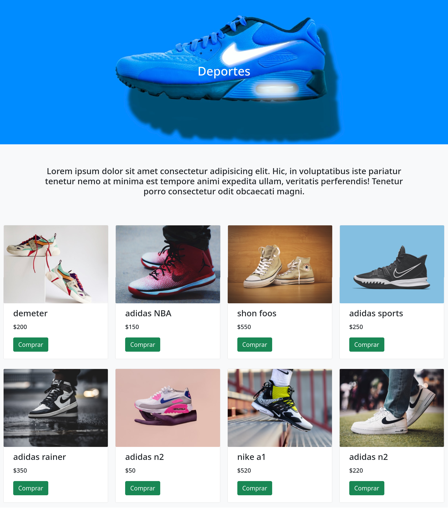
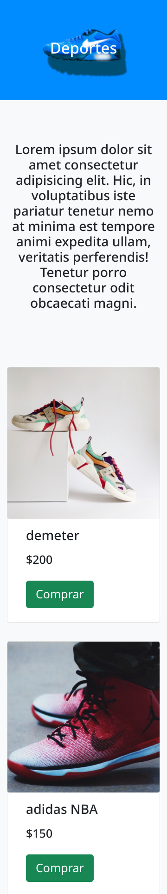

# alkemy-bootstrap
----
Consta de un desafio de crear unas, Paginas usando bootstrap para mejorar mis habilidades con este framework

EJERCITACIÓN REACT
----
Librería Frontend / Bootstrap

Objetivo de aprendizaje:
Implementar una librería de frontend, como Bootstrap.

Skills a entrenar:
----
Diseño Responsivo con Bootstrap
Consigna:
* Crear una página “carrito de compras” que liste 8 productos con imagen, nombre, título, descripción y precio.
* También debe representarse un caso de éxito en la compra.
* La página “carrito de compras” deberá verse como indica la imágen 1.
* Los requisitos en detalle son:
* La portada debe tener el título de la categoría y un fondo de foto / representativo.
* La descripción de la categoría debe tener un “lorem ipsum” o una descripción acorde.
* Cada producto tiene que tener una imagen representativa, pueden ser distintos o el mismo.
* Los precios deben ser distintos.
* Los botones [Comprar] (representados en verde) deben dirigirse a /comprar.html y deberá mostrar una copia del sitio pero con un “success” (alert en bootstrap) en verde. Como el indicado en la imagen 2.
<div>
  
  
</div>

----
Para arrancar el proyecto

```sh
$ git clone https://github.com/Soni295/alkemy-bootstrap.git
$ cd alkemy-bootstrap
$ npm start
```
  
  
